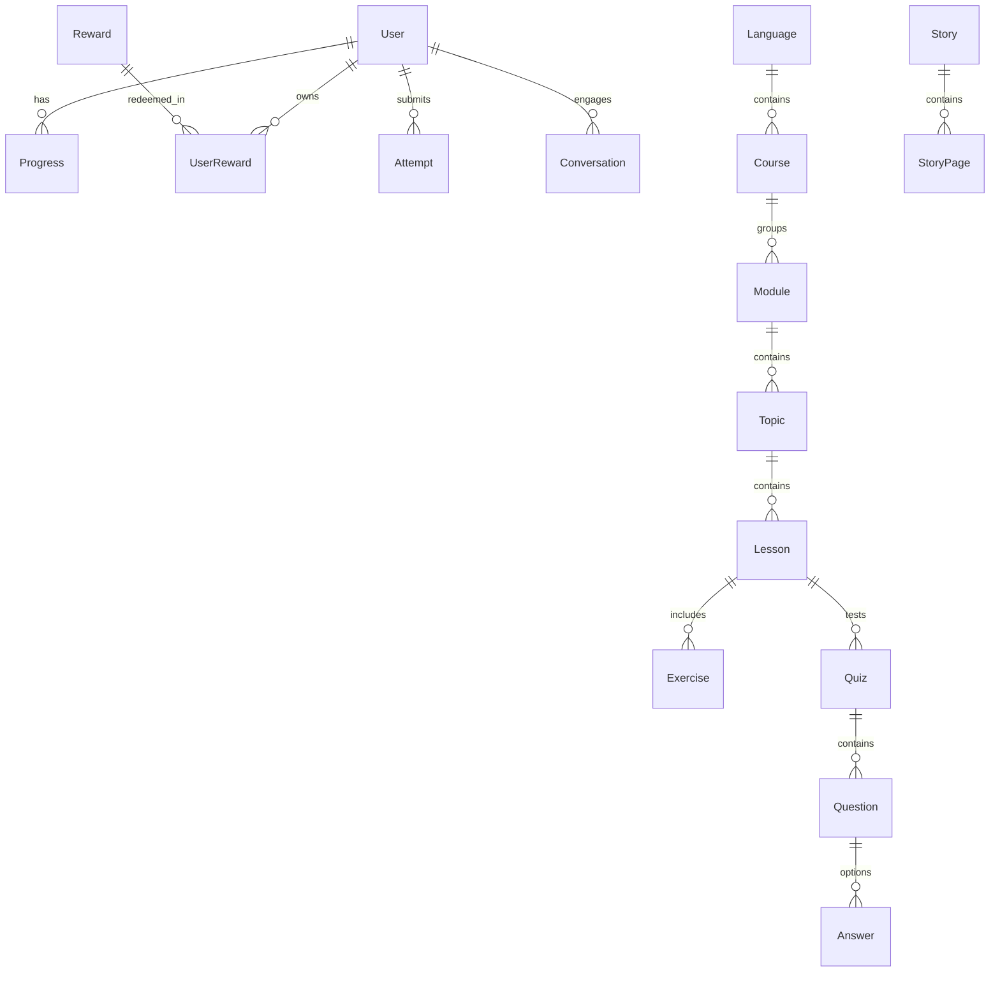

# LangSphere AI — Project Architecture & Technical Design

This document details the high-level system design, data architecture, security model, and directory layout for **LangSphere AI Version 1.0**.

---

## 🏛️ System Architecture Overview

LangSphere AI is built as a decoupled, multi-tier Single Page Application (SPA) backed by a RESTful Node.js TypeScript API server and a PostgreSQL relational database.

```
┌────────────────────────────────────────────────────────────────────────┐
│                        FRONTEND TIER (Vite + React)                    │
│                                                                        │
│  [ Smart Dashboard ]   [ Lessons Path ]   [ Story Reader ]  [ Shop ]   │
│  [ AI Tutor Chat ]     [ Handwriting ]    [ Vision OCR ]   [ Auth ]   │
└──────────────────────────────────┬─────────────────────────────────────┘
                                   │ HTTPS / REST (JSON)
                                   ▼
┌────────────────────────────────────────────────────────────────────────┐
│                   BACKEND API TIER (Express + TypeScript)              │
│                                                                        │
│  [ Auth Controller ]   [ Lesson Controller ]   [ Quiz Controller ]     │
│  [ Shop Controller ]   [ Story Controller ]    [ AI Controller ]       │
│                                                                        │
│                             Middlewares                                │
│       [ JWT Authenticate ]   [ ErrorHandler ]   [ CORS & Helmet ]      │
└──────────────────┬─────────────────────────────────┬───────────────────┘
                   │                                 │
                   │ Prisma ORM                      │ Google GenAI SDK
                   ▼                                 ▼
┌─────────────────────────────────────┐   ┌─────────────────────────────┐
│       DATABASE (PostgreSQL)         │   │   GOOGLE GEMINI 2.5 FLASH    │
│                                     │   │                             │
│  Users, Progress, Courses, Lessons, │   │  AI Conversational Tutor    │
│  Quizzes, Rewards, Stories, Records │   │  Handwriting Evaluator      │
└─────────────────────────────────────┘   │  Vision OCR Text Extractor  │
                                          └─────────────────────────────┘
```

---

## 📊 Database Schema Architecture

The relational database is managed via **Prisma ORM**. Key entities include:



### Core Models:
- **`User`**: Profile details, email, hashedPassword, role, xp, coins, streak, avatarUrl, frameId, title.
- **`Course` / `Module` / `Topic` / `Lesson`**: Hierarchical curriculum structure for English, Tamil, Hindi, and Telugu across Beginner, Intermediate, Advanced tiers.
- **`Exercise`**: Stores lesson content blocks (VOCABULARY, GRAMMAR, EXAMPLES) in flexible JSON structures.
- **`Quiz` / `Question` / `Answer`**: Interactive assessment engine with score evaluation.
- **`Progress`**: Unique composite key `(userId, lessonId)` tracking completion status, score, and timestamps.
- **`Reward` / `UserReward`**: Gamification items catalogue and user inventory mapping.
- **`Story` / `StoryPage`**: Multilingual cultural storybooks with translations.
- **`Conversation` / `AIMessage`**: Session-based chat history with AI Tutor.

---

## 🔒 Security Architecture

1. **Authentication**: Stateless JSON Web Tokens (JWT) signed with HMAC SHA-256.
2. **Domain Isolation**: Strict regex validation on registration restricting user domain to `@gmail.com` and `@saveetha.com`.
3. **Password Security**: Salted Bcrypt hashing with cost factor 10.
4. **API Security**: `helmet` header protections, strict CORS origins, sanitized SQL parameters via Prisma ORM prepared statements.
5. **AI Safety**: Fallback evaluation handling preventing runtime crashes when API credentials are absent.

---

## 📁 Repository Directory Structure

```
learning-problem-4/
├── backend-ts/                 # TypeScript Express Backend
│   ├── prisma/
│   │   ├── schema.prisma       # Database schema definition
│   │   └── seed.ts             # Comprehensive database seeder
│   ├── src/
│   │   ├── config/             # Environment configurations
│   │   ├── controllers/        # Route controllers (Auth, Lesson, Quiz, Shop, AI)
│   │   ├── middlewares/        # JWT Auth and Error handling
│   │   ├── routes/             # Express API routes
│   │   ├── services/           # Business logic services
│   │   ├── app.ts              # Express application configuration
│   │   └── server.ts           # Server entry point
│   ├── tsconfig.json
│   └── package.json
│
├── src/                        # React Frontend (Vite)
│   ├── components/             # Reusable UI components (Navbar, Sidebar, GlassCard)
│   ├── context/                # Auth & Theme Context providers
│   ├── pages/                  # Page Views (Dashboard, Lessons, Stories, Quiz, Shop, AI)
│   ├── services/               # API Client & service wrappers
│   ├── App.jsx                 # Application routes & ProtectedRoute wrapper
│   └── main.jsx                # Entry point
│
├── CHANGELOG.md                # Release version history
├── RELEASE_NOTES.md            # Official Version 1.0 release notes
├── USER_GUIDE.md               # End-user documentation
├── ADMIN_GUIDE.md              # Administrator setup guide
├── API_DOCUMENTATION.md        # REST API endpoint reference
├── DEPLOYMENT_GUIDE.md         # Production deployment manual
├── PROJECT_ARCHITECTURE.md     # System architecture overview
└── package.json
```
