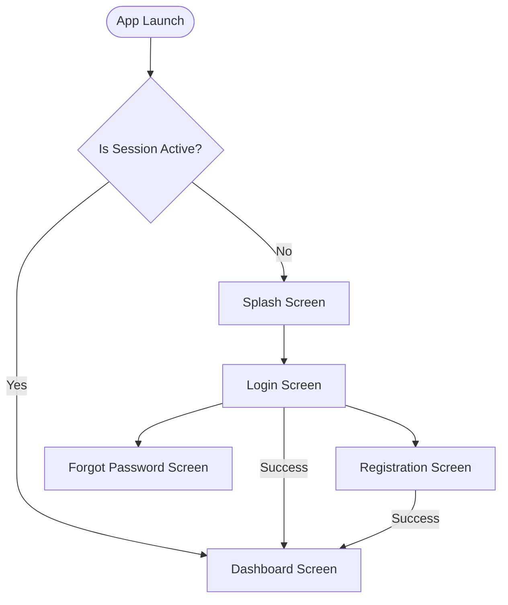
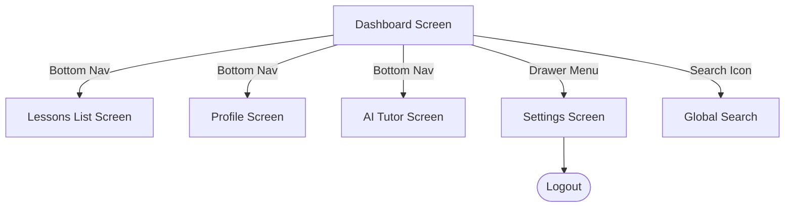
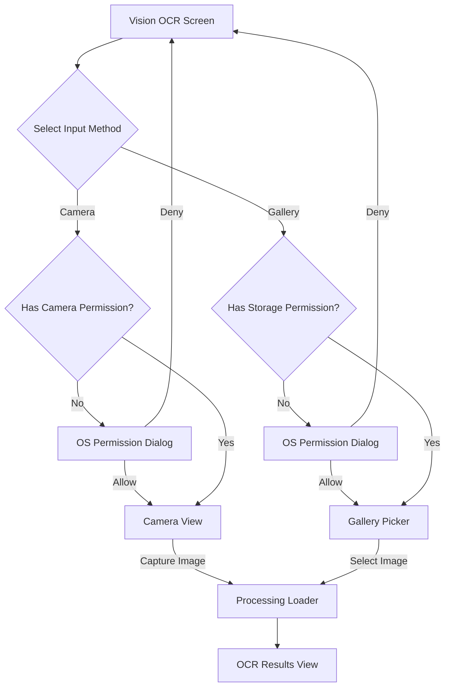
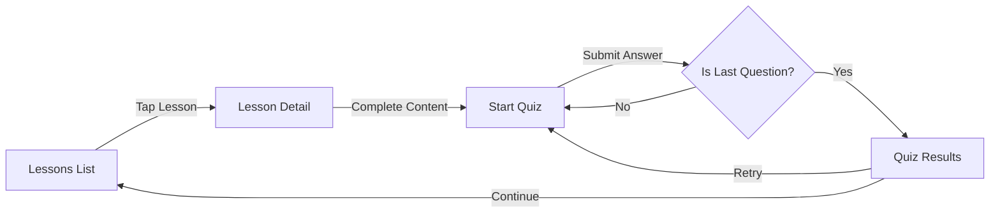

# Enterprise Mobile App - Screen Flow Analysis

This document represents the navigational topology and logical user flows across the mobile application.

## 1. High-Level Application Flow

## 2. Core Dashboard & Navigation Flow

## 3. Hardware / Vision OCR Flow
*Demonstrates mobile-specific permission and hardware flows.*

## 4. Assessment Workflow

## Page Object Model (POM) Strategy
Based on the flow analysis above, the framework will implement the following inheritance tree for Page Objects in the next phase:

1. **`BasePage.js`** (Master parent for all pages)
2. **`GlobalNavigationComponent.js`** (Handles Bottom Nav, Drawer - Extended by pages that feature it)
3. **Domain Pages**: `LoginPage.js`, `DashboardPage.js`, `AiTutorPage.js`, `VisionOcrPage.js`, etc.
4. **Native Dialog Components**: `PermissionDialog.js` (Handles OS-level UIAutomator alerts).
